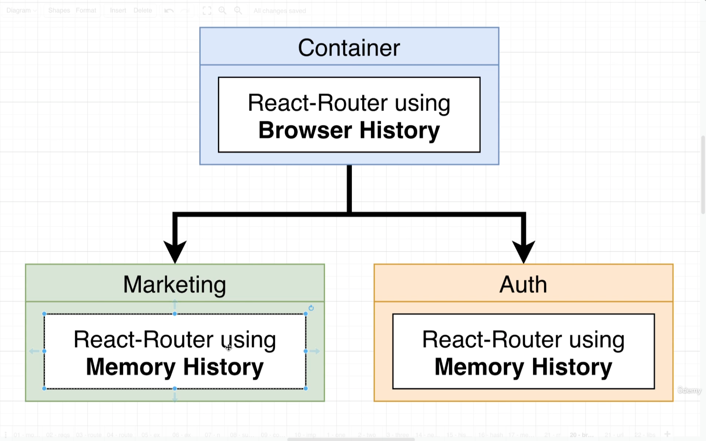
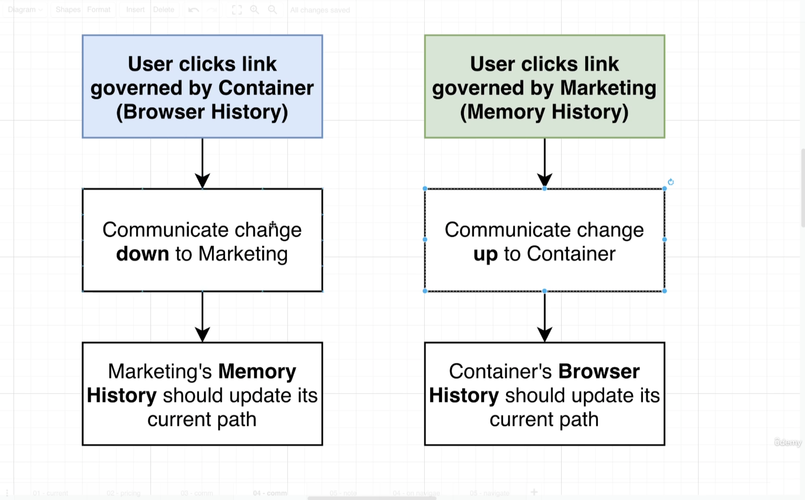
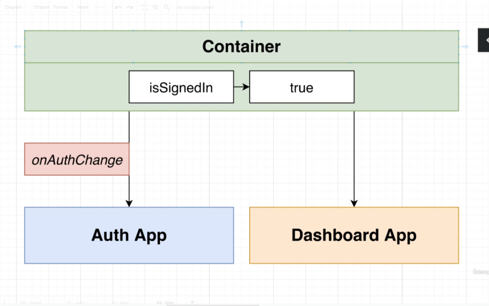

# microfrontend-course

# Routing Requirements

1. Both the container + individual sub-apps need routing features.
2. Sub-apps might need to add in new pages/routes all the time.
3. We might need to show two or more microfrontends at the same time.
4. We want ot use off-the-shelf routing solutions
5. We need navigation features for sub-apps in both hosted mode and in isolation.
6. If different apps need to communicate information about routing, it should be done in as generic fashion as possible.

## Routing architecture

The most common way to set up routing in an app with a microfrontend architecture involves utilizing browser history within the main container and memory history within individual sub-applications. This approach addresses the challenge posed by the custom implementations of navigation libraries like React-Router, Angular Router, and Vue-Router, each offering its own version of browser history and memory history. By maintaining a single browser history instance at the container level, potential conflicts arising from multiple instances trying to update the URL in the address bar simultaneously are mitigated. Instead, memory history instances within sub-applications manage their own navigation paths independently, ensuring smoother navigation and preventing race conditions that could lead to issues down the line.

# Notes around authentication

- Auth app is for signing in/up users.
- Auth app is not for enforcing permissions, allowing access to certain routes or figuring out if user is signed in.
- Two possible approaches for handling auth:

  1. Each app is aware of auth.
  2. **Centralize auth in Container (in this project we go with this one)**.

  

# AWS Setup and Configuration Cheetsheet

## S3 Bucket Creation and Configuration

1. Go to AWS Management Console and use the search bar to find S3

2. Click Create Bucket

3. Specify an AWS Region

4. Provide unique Bucket Name and click Create Bucket

5. Click the new Bucket you have created from the Bucket list.

6. Select Properties

7. Scroll down to Static website hosting and click Edit

8. Change to Enable

9. Enter index.html in the Index document field

10. Click Save changes

11. Select Permissions

12. Click Edit in Block all public access

13. Untick the Block all public access box.

14. Click Save changes

15. Type confirm in the field and click Confirm

16. Find the Bucket Policy and click Edit

17. Click Policy generator

18. Change Policy type to S3 Bucket Policy

19. Set Principle to \*

20. Set Action to Get Object

21. Copy the S3 bucket ARN to add to the ARN field and add /_ to the end.
    eg: arn:aws:s3:::mfe-dashboard/_

22. Click Add Statement

23. Click Generate Policy

24. Copy paste the generated policy text to the Policy editor

25. Click Save changes

## CloudFront setup

1. Go to AWS Management Console and use the search bar to find CloudFront

2. Click Create distribution

3. Set Origin domain to your S3 bucket

4. Find the Default cache behavior section and change Viewer protocol policy to Redirect HTTP to HTTPS

5. Scroll down and click Create Distribution

6. After Distribution creation has finalized click the Distribution from the list, find its Settings and click Edit

7. Scroll down to find the Default root object field and enter /container/latest/index.html

8. Click Save changes

9. Click Error pages

10. Click Create custom error response

11. Change HTTP error code to 403: Forbidden

12. Change Customize error response to Yes

13. Set Response page path to /container/latest/index.html

14. Set HTTP Response Code to 200: OK

## Create IAM user

1. Search for "IAM"

2. In the left sidebar, click Users under Access Management.

3. Click "Create user"

4. Enter any name you’d like in the "User Name" field.

5. Click "Next"

6. Click "Attach Policies Directly"

7. Use the search bar to find and tick AmazonS3FullAccess and CloudFrontFullAccess

8. Click "Next"

9. Click "Create user"

10. Select the IAM user that was just created from the list of users

11. Click "Security Credentials"

12. Scroll down to find "Access Keys"

13. Click "Create access key"

14. Select "Command Line Interface (CLI)"

15. Scroll down and tick the "I understand..." check box and click "Next"

16. Copy and/or download the Access Key ID and Secret Access Key to use for deployment.
